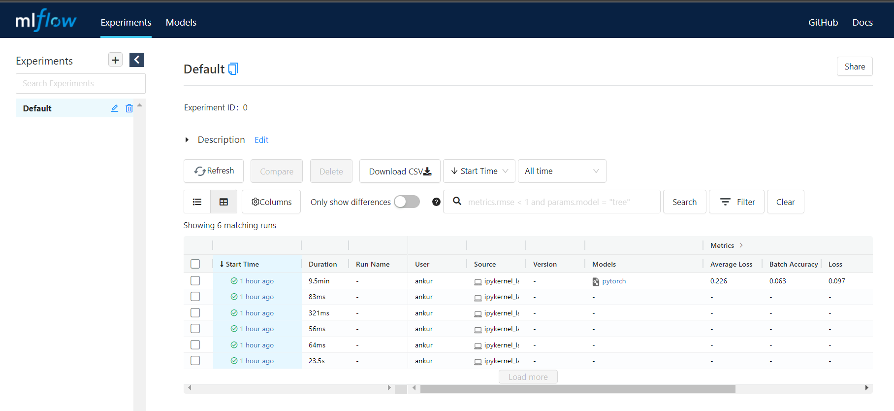
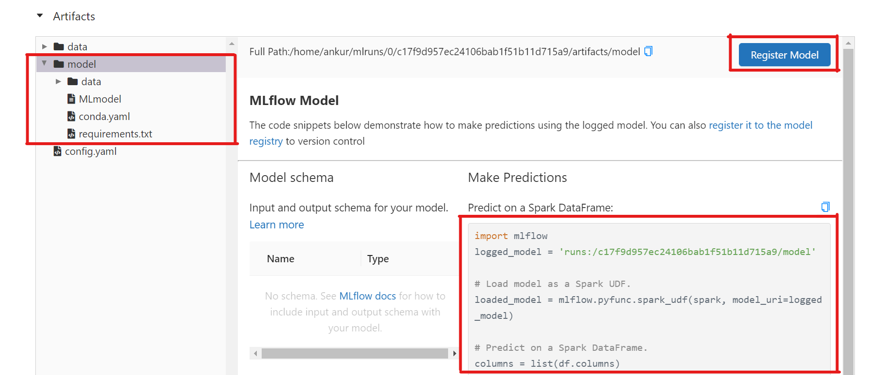

Data Science and Machine Learning is different from traditional software development. These fields are more experimental in nature. You often have to run the same code/script over and over again, with little change. After multiple runs, one has to decide which set of values (i.e. configuration) leads to best score. Also, the relation between hyper-parameters and model's performance is not always obvious. Hence, you need to track all your runs. To me, tracking runs means logging all the values that can help you decide the best configuration for training any model on a given dataset. 

Remember, tracking runs is just the first step. You also need good tools to visualize and analyse this data. A good tracking tool is extremely important for the success of any ML project. In this tutorial, we will be discussing one such tool : MLflow Tracking. MLflow is much more than a tracking tool, I would recommend checking the [MLflow website](https://mlflow.org) to learn more about all the components.

MLflow Tracking is organized around the concept of **runs**, which are executions of some piece of data science code. You can optionally organize *runs* into experiments, which group together *runs* for a specific task.

MLflow runs can be recorded to local files, to any SQLAlchemy compatible database, or remotely to a tracking server. By default, the MLflow Python API logs runs locally to files in an `mlruns` directory wherever you ran your program. You can then run `mlflow ui` to see the logged runs.

In this tutorial, I will discuss how to record runs using a MLflow tracking server (instead of logging locally in `mlruns` directory) because I like to have all my experiments in central place. Don't worry, we will be running the MLflow tracking server in our localhost, so you don't have to worry about deploying it. 

Lets dive in . . . 


```python
import mlflow
import torch
from torchvision import models
```

## Setup

First, you need to start a tracking server. An MLflow tracking server has two components for storage: a **backend store** and an **artifact store**.

### Backend Store

The backend store is where MLflow Tracking Server stores experiment and run metadata as well as params, metrics, and tags for runs. MLflow supports two types of backend stores: file store and database-backed store. 

> Note: In order to use model registry functionality, you must run your server using a `database-backed` store.

Use `--backend-store-uri` to configure the type of backend store. You specify:

- A file store backend as ``./path_to_store` or `file:/path_to_store`

- A database-backed store as SQLAlchemy database URI. MLflow supports the database dialects *mysql*, *mssql*, *sqlite*, and *postgresql*. For example, to use a local SQLite database pass `--backend-store-uri sqlite:///mlflow.db`.
    
By default `--backend-store-uri` is set to the local `./mlruns` directory (the same as when running mlflow run locally), but when running a server, make sure that this points to a persistent (that is, non-ephemeral) file system location.

### Artifact Store

The artifact store is a location suitable for large data (such as an S3 bucket or shared NFS file system) and is where clients log their artifact output (for example, model weights). 

In addition to local file paths, MLflow supports the following storage systems as artifact stores: Amazon S3, Azure Blob Storage, Google Cloud Storage, SFTP server, and NFS. In this tutorial, we will store all our artifacts in local file system. So, detailed discussion of how to use other artifact stores is beyond the scope of this tutorial. If you are interested, you can read more about it [here](https://mlflow.org/docs/latest/tracking.html#artifact-stores) and [here](https://mlflow.org/docs/latest/tracking.html#how-runs-and-artifacts-are-recorded).

Use `--default-artifact-root` (defaults to local `./mlruns` directory) to configure default location to server’s artifact store. 

> **Note:** This will be used as artifact location for newly-created experiments that do not specify one. Once you create an experiment, `--default-artifact-root` is no longer relevant to that experiment. Don't worry if this note doesn't make any sense. Just don't change the location of artifact store between experiments.


Now that you know what is *backend-store* and *artifact store*, and how to configure them; lets start the MLflow tracking server. Run the following command in your shell. 

```bash
mlflow server --backend-store-uri sqlite:///./mlflow.db --default-artifact-root /home/ankur/mlruns/
```

Here, instead of sqlite & local file system, you can use any combination of *backend-store* and *artifact-store*.

**Note:** Don't try to run MLflow inside docker container if you plan to use local file system to store your artifacts. The best practice for artifact storage with a remote tracking server is to configure the server to use an artifact root accessible to both clients and the server (e.g. an S3 bucket or Azure Blob Storage URI). Read [this Stack Overflow discussion] for better understanding. 

Once we have the server up and running, you will see something like this in your std-output. 


Take note of the URI that your service is listening at. Finally, we just have to connect mlflow to the tracking server. This is extremely easy, just call `mlflow.set_tracking_uri()`


```python
mlflow.set_tracking_uri('http://127.0.0.1:5000')
```

to check the current tracking server one can use `get_tracking_uri()`


```python
mlflow.get_tracking_uri()
```


    'http://127.0.0.1:5000'


**Note:** you can also set the `MLFLOW_TRACKING_URI` environment variable to the server’s URI, along with its scheme and port (for example, http://10.0.0.1:5000)

## Logging

Perfect, we are all set to log our runs and artifact to MLflow server. Lets discuss some logging function . . . 

- `mlflow.log_param()` logs a single key-value param in the currently active run. The key and value are both strings. Use `mlflow.log_params()` to log multiple params at once. This function can be used to log training parameters, model hyper-parameters, etc.


```python
## logging single parameter
mlflow.log_param("n_estimators", 10)
mlflow.log_param("max_dept", 4)

## logging multiple parameters
params = {"n_estimators" : 10, "max_dept" : 4}
mlflow.log_params(params)
```

- `mlflow.log_metric()` logs a single key-value metric. The value must always be a number. MLflow remembers the history of values for each metric. Use `mlflow.log_metrics()` to log multiple metrics at once. This function can be used to track various metrics and losses across different datasets (train, valid and test).


```python
## logging single metric
mlflow.log_metric("mse", 2500.0)
mlflow.log_metric("rmse", 50.0)

## logging multiple metrics
metrics = {"mse": 2500.00, "rmse": 50.00}
mlflow.log_metrics(metrics)
```

- `mlflow.log_artifact()` logs a local file or directory as an artifact, optionally taking an `artifact_path` to place it in within the run’s artifact URI. Run artifacts can be organized into directories, so you can place the artifact in a directory this way. This method can be use to log any type of file (images, model weights, config files, pickle files, etc.) 

    Similar to other function, there's also a `mlflow.log_artifacts()` function that logs all the files in a given directory as artifacts, again taking an optional `artifact_path`.


```python
# logging single artifact : 
# With 'artifact_path=None' write "data/config.yaml" under
# root artifact_uri/artifacts directory
path = "data/config.yaml"
mlflow.log_artifact(path)

# logging multiple artifact : 
# Write all files in "data" to root artifact_uri/data
path = "data"
mlflow.log_artifacts(path, artifact_path="data")
```

- MLflow includes integrations with several common libraries. For example, `mlflow.pytorch` contains `save_model`, `log_model`, and `load_model` functions for pytorch models. MLflow models is discussed in depth [here](). I would highly recommend reading it next.


```python
model = models.vgg11_bn(pretrained=False)
model.eval() # important
mlflow.pytorch.log_model(model, 'model')
```


    ModelInfo(artifact_path='model', flavors={'pytorch': {'model_data': 'data', 'pytorch_version': '1.10.1'}, 'python_function': {'pickle_module_name': 'mlflow.pytorch.pickle_module', 'loader_module': 'mlflow.pytorch', 'python_version': '3.8.12', 'data': 'data', 'env': 'conda.yaml'}}, model_uri='runs:/b8faa5ac96b547af9ad9c9d5f1b88f42/model', model_uuid='ea334f7c3e5b44ee9c26f6c89265c47c', run_id='b8faa5ac96b547af9ad9c9d5f1b88f42', saved_input_example_info=None, signature_dict=None, utc_time_created='2022-02-25 19:02:26.117305')


MLflow packages your model in "MLflow Model" format. An MLflow Model is a standard format for packaging machine learning models that can be used in a variety of downstream tools—for example, real-time serving through a REST API or batch inference on Apache Spark. Its also records the environment and other details that are important for loading the model back. I wrote a detail blog discussing [MLflow Model](https://ankur-singh.github.io/blog/packaging-ml-models). 

I would highly recommend you to visit [MLflow Python API page](https://mlflow.org/docs/latest/python_api/mlflow.html) and search for each of the above functions, and read the document to better understand the expected input format.

## Few more concepts 

Before you can start using MLflow Tracking, there are a few more things that you need to know. We will discuss these concepts before starting with an end-to-end example.

### Runs

As mentioned above, MLflow Tracking is organized around the concept of **runs**, which are executions of some piece of data science code. There are two important functions that you should know : `mlflow.start_run()` and `mlflow.end_run()`. Both function names are quite self explanatory but a formal definition from the docs never hurts 😜

- `mlflow.start_run()` returns the currently active run (if one exists), or starts a new run. 

    **Note:** You do not need to call `mlflow.start_run()` explicitly: calling one of the logging functions with no active run automatically starts a new one.

- `mlflow.end_run()` ends the currently active run, if any, taking an optional run status.

Since, any logging function will automatically start a new run if no active run is detected. Our very first loggging function (i.e. `mlflow.log_param()`) has implicitly started a run. So, we will have to end the current run before we can start a new run. 


```python
mlflow.end_run() # ending the previous run . . . 
```


```python
import mlflow

mlflow.start_run()
mlflow.log_param("my", "param")
mlflow.log_metric("score", 100)
mlflow.end_run()
```

For the same reason, you can also remove the `mlflow.start_run()` line from the above code, and it will still work. But always remember to call `mlflow.end_run()` after logging everything associated with the current run. Its just like closing the socket connection after use. 


```python
mlflow.log_param("my", "param")
mlflow.log_metric("score", 100)
mlflow.end_run()
```

You can also use the context manager syntax, which automatically terminates the run at the end of the with block. For example:


```python
with mlflow.start_run() as run:
    mlflow.log_param("my", "param")
    mlflow.log_metric("score", 100)
```

The *run* remains open throughout the `with` statement, and is automatically closed when the statement exits, even if it exits due to an exception.

This will also allow you to launch multiple MLflow runs in the same program: for example, maybe you are performing a hyperparameter search locally or your experiments are just very fast to run. You can “scope” each run to just one block of code.

### Performance Tracking with Metrics

You log MLflow metrics with log methods in the Tracking API. The log methods support two alternative methods for distinguishing metric values on the x-axis: *timestamp* and *step*.

- *timestamp* is an optional long value that represents the time that the metric was logged. *timestamp* defaults to the current time.
- *step* is an optional integer that represents any measurement of training progress (number of training iterations, number of epochs, and so on). *step* defaults to 0 and has the following requirements and properties:

    - Must be a valid 64-bit integer value.
    - Can be negative.
    - Can be out of order in successive write calls. For example, (1, 3, 2) is a valid sequence.
    - Can have “gaps” in the sequence of values specified in successive write calls. For example, (1, 5, 75, -20) is a valid sequence.

**Note:** If you specify both a timestamp and a step, metrics are recorded against both axes independently.


```python
with mlflow.start_run():
    for epoch in range(0, 3):
        mlflow.log_metric(key="quality", value=2*epoch, step=epoch)
```

Now we have all the piece to track our experiments. Lets look at an end-to-end example . . .

## End-to-end example

For simplicity, I have taken FashionMNIST example from the official Pytorch tutorials. You can find the tutorial [here](https://pytorch.org/tutorials/beginner/introyt/trainingyt.html). I won't be discussing the code in detail. So, its important that the reader is comfortable with pytorch to follow along. 

If you have ever used pytorch to train a DL model then you should feel at home. I will request you to focus on the MLflow code, and see how it works together with pytorch.


```python
import torch
import torch.nn as nn
import torch.nn.functional as F

import torchvision
import torchvision.transforms as transforms

import math
import time
import mlflow
import numpy as np
import matplotlib.pyplot as plt
```


```python
BATCH_SIZE = 64
EPOCHS = 3
OPTIMIZER = 'adam'
LR = 0.001
DEVICE = 'cuda' if torch.cuda.is_available() else 'cpu'
```


```python
transform = transforms.Compose(
    [transforms.ToTensor(),
    transforms.Normalize((0.5,), (0.5,))])

# Create datasets for training & validation, download if necessary
training_set = torchvision.datasets.FashionMNIST('./data', train=True, transform=transform, download=True)
validation_set = torchvision.datasets.FashionMNIST('./data', train=False, transform=transform, download=True)

# Create data loaders for our datasets; shuffle for training, not for validation
training_loader = torch.utils.data.DataLoader(training_set, batch_size=BATCH_SIZE, shuffle=True, num_workers=2)
validation_loader = torch.utils.data.DataLoader(validation_set, batch_size=BATCH_SIZE, shuffle=False, num_workers=2)

# Class labels
classes = ('T-shirt/top', 'Trouser', 'Pullover', 'Dress', 'Coat',
        'Sandal', 'Shirt', 'Sneaker', 'Bag', 'Ankle Boot')

# Report split sizes
print('Training set has {} instances'.format(len(training_set)))
print('Validation set has {} instances'.format(len(validation_set)))
```

    Training set has 60000 instances
    Validation set has 10000 instances


```python
# Helper function for inline image display
def matplotlib_imshow(img, one_channel=False):
    if one_channel:
        img = img.mean(dim=0)
    img = img / 2 + 0.5     # unnormalize
    npimg = img.numpy()
    if one_channel:
        plt.imshow(npimg, cmap="Greys")
    else:
        plt.imshow(np.transpose(npimg, (1, 2, 0)))

dataiter = iter(training_loader)
images, labels = dataiter.next()

# Create a grid from the images and show them
img_grid = torchvision.utils.make_grid(images[:4])
matplotlib_imshow(img_grid, one_channel=True)
print('       '.join(classes[labels[j]] for j in range(4)))
```

    Trouser       Trouser       Ankle Boot       Bag


    

    


```python
model = torchvision.models.efficientnet_b0(pretrained=True)

# updating the input layer and output layer
model.features[0][0] = nn.Conv2d(1, 32, kernel_size=(3, 3), stride=(2, 2), padding=(1, 1), bias=False)
model.classifier[1] = nn.Linear(1280, len(classes), bias=True)
model = model.to(DEVICE)
```


```python
loss_fn = torch.nn.CrossEntropyLoss()
optimizer = torch.optim.Adam(model.parameters(), lr=LR)
```


```python
def train_step(model, train_loader, device, optimizer, epoch, batch_size):
    # training
    model.train()
    avg_loss = 0.0
    avg_acc = 0.0
    start_time = time.time()
    for batch_no, (inputs, labels) in enumerate(train_loader):

        inputs, labels = inputs.to(device), labels.to(device)
        
        optimizer.zero_grad()
        outputs = model(inputs)

        loss = loss_fn(outputs, labels)
        loss.backward()
        optimizer.step()

        logits = F.softmax(outputs.norm(dim=-1), dim=-1)
        _, pred_label = torch.max(logits.data, dim=0)
        pred_label = pred_label.to(device)
        train_acc = (pred_label == labels.data).double().sum()
        
        mlflow.log_metric(
            "Batch Accuracy",
            train_acc.item() / batch_size,
            step=math.ceil(epoch * len(train_loader) / batch_size) + batch_no,
        )
        mlflow.log_metric(
            "Loss",
            loss.item(),
            step=math.ceil(epoch * len(train_loader) / batch_size) + batch_no,
        )
        avg_acc += train_acc.item()
        avg_loss += loss.item()
        
    total_time = time.time() - start_time
    avg_acc /= len(train_loader)
    avg_loss /= len(train_loader)
    mlflow.log_metric("Train Accuracy", avg_acc, step=epoch)
    mlflow.log_metric("Average Loss", avg_loss, step=epoch)
    mlflow.log_metric("Time Taken", total_time, step=epoch)


def test_step(model, test_loader, device, epoch):
    # testing
    model.eval()
    correct_cnt = 0
    total_cnt = 0
    for batch_idx, (inputs, labels) in enumerate(test_loader):
        inputs, labels = inputs.to(device), labels.to(device)

        outputs = model(inputs)
        
        logits = F.softmax(outputs.norm(dim=-1), dim=-1)
        _, pred_label = torch.max(logits.data, dim=0)
        pred_label = pred_label.to(device)
        total_cnt += inputs.shape[0]
        correct_cnt += (pred_label == labels).sum()
        
    test_acc = correct_cnt.item() * 1.0 / total_cnt
    mlflow.log_metric("Test Accuracy", test_acc, step=epoch)
    return test_acc
```


```python
# Initializing in a separate cell so we can easily add more epochs to the same run
training_parameters = {
        "Batch Size": BATCH_SIZE,
        "Epochs": EPOCHS,
        "Optimizer": OPTIMIZER,
        "Learning Rate": LR,
        "GPU Used": DEVICE,
    }
```


```python
best_acc = 0.0
best_epoch = 0
with mlflow.start_run():
    mlflow.log_params(training_parameters)
    for epoch in range(EPOCHS):
        train_step(
            model=model,
            train_loader=training_loader,
            device=DEVICE,
            optimizer=optimizer,
            epoch=epoch,
            batch_size=BATCH_SIZE,
        )
        test_acc = test_step(
                        model=model, 
                        test_loader=validation_loader, 
                        device=DEVICE, 
                        epoch=epoch
        )
        
        print(f"[{epoch+1}/{EPOCHS}] : {test_acc}")
        if test_acc > best_acc:
            best_acc = test_acc
            best_epoch = epoch
            mlflow.pytorch.log_model(model, artifact_path="best_model")
```

    [1/3] : 0.0169
    [2/3] : 0.0172
    [3/3] : 0.018


As you can see, MLflow is very easy to use and is very pythonic. You can find more such examples [here](https://github.com/mlflow/mlflow/tree/master/examples). As an exercise, try adding MLflow tracking to any of your past project. Writing this blog was a good practice for me to better understand how MLflow tracking works. 

### AutoLog

As you can see, its a lot of extra code. MLflow provides this amazing feature called **Automatic logging**. It allows you to log metrics, parameters, and models without the need for explicit log statements.

There are two ways to use autologging:

- Call `mlflow.autolog()` before your training code. This will enable autologging for each supported library you have installed as soon as you import it.

- Use library-specific autolog calls for each library you use in your code.

I won't be discussing this feature in detail. So, if you are interested, you can read more about it [here](https://mlflow.org/docs/latest/tracking.html#automatic-logging).

## MLflow UI

MLflow comes with a visualization tool (called MLflow UI). So, everything that is logged (metrics, models, parameters, etc) is available for you to interact with. Just visit the tracking server URI in your browser. Here, since I am running the server in my localhost I will visit `127.0.0.1:5000` 

You will see a nice web-app



For each run, you can see all the metrics and parameters logged. You can also look at the artifacts. The UI is simple and very intuitive. Just play around with it for few minutes. 

Another amazing features is that you can access all this information programmatically as well (using MLflow API). This is really important for automation and CI/CD. We can discuss this in more detail in some other blog or if you are very curious then you can read the mlflow docs 😋

Also, pay special attention to MLflow model artifact. MLflow will automatically update the preview to show how to load the model, and a button to register the model in MLflow model registry. To learn more about MLflow model artifact, you can read [this blog](https://ankur-singh.github.io/blog/packaging-ml-models).



As you might have realised, MLflow is a feature rich tool for MLOps. You can use it for logging, packaging projects and models. Along with a UI to visualizing experiments, MLflow also offers a model registry that you can use to maintain your ML models. 

Thats all for this blog, hope it was helpful.

## References

- [MLflow docs](https://mlflow.org/docs/latest/index.html)
- [MLflow docs - Tracking](https://mlflow.org/docs/latest/tracking.html)
- [Track machine learning experiments with MLFlow](https://aahansingh.com/experimentation-tracking-with-mlflow-part-1)
- [Training with Pytorch](https://pytorch.org/tutorials/beginner/introyt/trainingyt.html)
