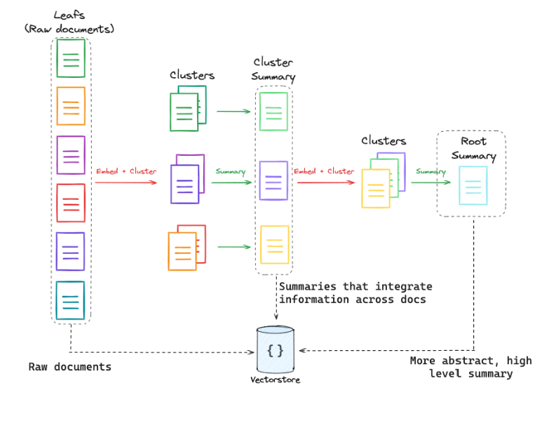

Retrieval Augmented Generation (RAG) systems have grown in popularity over the last few months, and honestly, I'm not surprised. It is one of the most effective ways for enterprises to prevent LLMs from hallucinating by grounding them. It also allows enterprises to use the plethora of raw data (mostly textual) that they have been collecting over the years. Textual data stored in PDFs, Word documents, websites, messages, emails, etc., was all sitting idle. RAG allows one to put all this data to use. Furthermore, the interface couldn't be simpler. You have a chat interface where you can ask questions as if you are asking an expert professional (expert HR, expert lawyer, etc.).

In Retrieval Augmented Generation (RAG) one combines information retrieval with language modelling. Typically a large language model (aka LLM), is augmented with a retrieval mechanism that allows it to access and incorporate information from external knowledge sources such as databases, documents, or the web. This retrieved context helps the model to generate more informed and contextually relevant responses by leveraging external knowledge during the generation process.

The RAG model consists of two main components:

1. **Retriever**: This component is responsible for retrieving relevant information from external knowledge sources based on the input query. The retriever can use various techniques such as keyword matching, semantic similarity, or pre-trained retriever models to identify relevant passages or documents. Additionally, separate knowledge base offers many other advantages like hot updates and real-time information.

2. **Generator**: The generator component takes both the input query and the retrieved information as input and generates the final response or output. This component typically utilizes a generative language model, such as GPT, to generate natural language responses based on the combined input.

RAG models have demonstrated significant improvements in various natural language understanding and generation tasks, including question answering, summarization, and dialogue generation. By integrating external knowledge into the generation process, RAG enables more accurate, informative, and contextually relevant responses, making it a powerful tool for a wide range of applications in natural language processing.

There are many ways to ingest and retrieve documents. Instead of throwing all the complex and confusing terms at once, I would like to build it incrementally so that you understand the motivation for each method and what problem it solves. However, there is no silver bullet. Hence, this approach will serve as a good mental exercise to see how to think through the problem at hand and determine which method to use.

> This blog assumes that you have processed all your documents and split them into chunks. If you haven't, please make sure you do that first. If you have heard "chunking" for the first time, refer [this detailed YouTube video](https://youtu.be/8OJC21T2SL4?si=Al3qhrUSZiSOPNgb) by Greg Kamradt. Once you are done chunking, this blog will guide you from there.

> The blog only has code snippets. The cell outputs are removed. The choice was intensional as it was necessary to maintaince the lenght as well as the flow to the blog. If interested, you can find the notebook with the cell output [here](TODO).

### 1. Simplest RAGs

We will be building the simplest RAG possible. I will grab three blogs on "Alignment" from [here](https://lilianweng.github.io/) and split them into chunks. I will quickly skim through it so that we can get to the main focus of this blog: Retrieval.

```python
import bs4
from langchain_community.document_loaders import AsyncHtmlLoader
from langchain_community.document_transformers import MarkdownifyTransformer
from langchain.text_splitter import RecursiveCharacterTextSplitter

blogs = [
    "https://lilianweng.github.io/posts/2023-03-15-prompt-engineering/",
    "https://lilianweng.github.io/posts/2021-03-21-lm-toxicity/",
    "https://lilianweng.github.io/posts/2021-01-02-controllable-text-generation/",
]

loader = AsyncHtmlLoader(web_path=blogs)
docs = loader.load()
```

Now, I will prepare the document before chunking
```python
def strain(doc):
    doc.page_content = str(
        bs4.BeautifulSoup(
            doc.page_content,
            "html.parser",
            parse_only=bs4.SoupStrainer(
                class_=("post-content", "post-title", "post-header")
            ),
        )
    )
    return doc


docs = [strain(doc) for doc in docs]
md = MarkdownifyTransformer(strip="a")
docs = md.transform_documents(docs)
```

```python
## Chunking
text_splitter = RecursiveCharacterTextSplitter(chunk_size=2500, chunk_overlap=500)
chunks = text_splitter.split_documents(docs)
```

Next, I will define the other components of our RAG application: the embedding model, the vector database, and the language model.

```python
from langchain_community.vectorstores import Chroma
from langchain_community.chat_models import ChatOllama
from langchain_community.embeddings import OllamaEmbeddings

# Embeddings model
ollama_embeddings = OllamaEmbeddings(model="snowflake-arctic-embed:latest")

# Vector store
vector_store = Chroma.from_documents(chunks, ollama_embeddings)
retriever = vector_store.as_retriever()

# Language model
llm = ChatOllama(model="llama3")
```

The last thing we need is a prompt template with the user query and context as input variables.

```python
from langchain.prompts import ChatPromptTemplate
from langchain_core.output_parsers import StrOutputParser

template = """Answer the question based only on the information in the following text:
{context}

Question: {question}

Answer:
"""

prompt = ChatPromptTemplate.from_template(template)
```

Lets put it all together . . . 

```python
def format_docs(docs):
    "Helper function to combine all docs"
    return "\n\n".join([doc.page_content for doc in docs])


def simple_rag_chain(question):
    relevant_docs = retriever.invoke(question)
    final_prompt = prompt.invoke(
        {"context": format_docs(relevant_docs), "question": question}
    )
    return StrOutputParser().invoke(llm.invoke(final_prompt))


question = "What is prompt engineering?"
response = simple_rag_chain(question)
```

This should return a LLM response answering the user's question. Since the focus of the blog is on retrieval, let's look at the documents that are retrieved based on the user's question.

```python
def display_docs(docs):
    for doc in docs:
        print(f"SOURCE : {doc.metadata['source']}")
        print(doc.page_content)
        print("*" * 80)


retrieved_docs = retriever.invoke(question)
display_docs(retrieved_docs)
```

If you examine the content of the documents we retrieved, you'll quickly notice that most documents are barely relevant. Only one document (from "Prompt Engineering" blog) that contains meaningful information for the LLM. Don't be discouraged; in fact, this presents a great opportunity for improvement. We'll explore various methods to enhance this.

## Understanding and Tuning the Retriever

One of the easiest and most obvious steps to take is tuning the retriever parameters. However, before delving into that, it's crucial to grasp what exactly a Retriever entails.

### Retriever

A retriever serves as an interface that retrieves documents based on an unstructured query. It's a broader concept compared to a vector store, as it doesn't necessarily store documents but focuses on retrieving them. While vector stores can serve as the foundation of a retriever, various other types of retrievers exist. Langchain offers several advanced retrieval methods, which you can explore in full [here](https://python.langchain.com/docs/modules/data_connection/retrievers/). Similar to chunking, retrieval might appear straightforward, but it can become complex in practice, so proceed with caution!

In our scenario, we instantiated our `retriever` object by invoking the `as_retriever` method of the `vector_store`. To gain more control over the retriever initialized from the vector store, you can specify the following arguments:

- `search_type` (Optional[str]): This parameter defines the type of search that the Retriever should perform. It can be "similarity" (default), "mmr", or "similarity_score_threshold".
- `search_kwargs` (Optional[Dict]): These are keyword arguments passed to the search function, which can include parameters like:
    - `k`: Determines the number of documents to return (Default: 4)
    - `score_threshold`: Sets the minimum relevance threshold for similarity_score_threshold
    - `fetch_k`: Determines the number of documents to pass to the MMR algorithm (Default: 20)
    - `lambda_mult`: Dictates the diversity of results returned by MMR, with 1 indicating minimum diversity and 0 indicating maximum. (Default: 0.5)
    - `filter`: Allows filtering by document metadata

For examples, you can refer to [this link](https://python.langchain.com/docs/modules/data_connection/retrievers/vectorstore/). To gain a deeper understanding of `search_kwargs`, you can refer to the [code](https://github.com/langchain-ai/langchain/blob/ba9dc04ffade8d8b3a92ca3f0b57d4ae99754db3/libs/core/langchain_core/vectorstores.py#L692). Depending on the `search_type`, the corresponding method of the vector store is invoked with `search_kwargs`. Below is a code snippet for reference:

```python
if self.search_type == "similarity":
    docs = self.vectorstore.similarity_search(query, **self.search_kwargs)
elif self.search_type == "similarity_score_threshold":
    docs_and_similarities = (
        self.vectorstore.similarity_search_with_relevance_scores(
            query, **self.search_kwargs
        )
    )
    docs = [doc for doc, _ in docs_and_similarities]
elif self.search_type == "mmr":
    docs = self.vectorstore.max_marginal_relevance_search(
        query, **self.search_kwargs
    )
else:
    raise ValueError(f"search_type of {self.search_type} not allowed.")
return docs
```

### Hyper-parameter Tuning for the Retriever

Now that we understand the different arguments it takes, let's tune it.

```python
retriever_score = vector_store.as_retriever(
    search_type="similarity_score_threshold", search_kwargs={"score_threshold": 0.0}
)
retrieved_docs = retriever_score.invoke(question)
print(f"Total Documents: {len(retrieved_docs)}")
display_docs(retrieved_docs)
```

If you examine the warning message closely, you'll notice that the similarity scores are negative values ranging from -250 to -180. It's no surprise that we don't see any documents even when we keep the threshold at 0. Let's try the Max Marginal Relevance (MMR) search type instead.

```python
retriever_mmr = vector_store.as_retriever(
    search_type="mmr", search_kwargs={"fetch_k": 4}
)
retrieved_docs = retriever_mmr.invoke(question)
print(f"Total Documents: {len(retrieved_docs)}")
display_docs(retrieved_docs)
```

The same documents as before, huh? Not good! You should experiment with other parameters and see if you can enhance the results.

For now, I'll leave it as an exercise for the reader and move on to discussing other methods to improve it.

## Different Perspectives

The most basic approach would be to ask our LLM to generate different versions of the user query. This is know as [expansion](https://python.langchain.com/v0.1/docs/use_cases/query_analysis/techniques/expansion/).

In practice, we simply need to prompt the LLM to generate multiple variations of the user question. Here's what the code looks like:
```python
template = """You are an AI language model assistant. Your task is to generate only three 
different versions of the given user question to retrieve relevant documents from a vector 
database. By generating multiple perspectives on the user question, your goal is to help
the user overcome some of the limitations of the distance-based similarity search. 
Provide these alternative questions separated by newlines. Don't generate anything else. 
Original question: {question}

Alternatives:
"""
prompt_perspectives = ChatPromptTemplate.from_template(template)

generate_queries = (
    prompt_perspectives | llm | StrOutputParser() | (lambda x: x.split("\n"))
)
queries = generate_queries.invoke(question)
```
> **Note:** In the above cell, I made use of LangChain Expression Language (LCEL). Checkout the last part of the blog for resources.

Now, we can take these generated questions along with the original question and retrieve all the relevant documents for each.

```python
queries.append(question)
retrieved_docs = [retriever_mmr.invoke(q) for q in queries]
retrieved_docs = [
    doc for sublist in retrieved_docs for doc in sublist
]  # flatten the list
print(f"Total Documents: {len(retrieved_docs)}")
display_docs(retrieved_docs)
```

The first thing you'll observe is that we have a lot more documents, some of which are duplicates. We can reduce the number by deduplicating the retrieved documents. Here's a helper function for it:

```python
from langchain.load import dumps, loads

def deduplicate(docs: list[list]):
    flatten_docs = [dumps(doc) for doc in docs]
    unique_docs = list(set(flatten_docs))
    return [loads(doc) for doc in unique_docs]


retrieved_docs = deduplicate(retrieved_docs)
print(f"Total Documents: {len(retrieved_docs)}")
display_docs(retrieved_docs)
```

`deduplicate` function will remove all the ducplicate documents. Deduplication is very important and is often used with other techniques that we'll learn next.

Another strategy is to adjust the prompt to break down the user question into multiple simpler sub-questions (refer to [decomposition](https://python.langchain.com/v0.1/docs/use_cases/query_analysis/techniques/decomposition/)) instead of generating multiple versions. Alternatively, you can generate broader questions (refer to [step back](https://python.langchain.com/v0.1/docs/use_cases/query_analysis/techniques/step_back/)) that might help retrieve better documents. This approach, where multiple questions are generated from a user query, is known as **Multi-Query**. LangChain provides a [`MultiQueryRetriever`](https://python.langchain.com/v0.1/docs/modules/data_connection/retrievers/MultiQueryRetriever/) class for such an approach. Feel free to experiment with this idea.

## Hypothetical Document Embeddings (HyDE)

Conceptually, we're essentially retrieving documents whose embeddings are closest to the question's embedding. Our input is a question, while the documents in the vector store are document chunks. Though both are text, they differ significantly in concept. A question typically represents a specific query or inquiry, seeking concise information or clarification. On the other hand, document chunks often contain broader and more detailed content, encompassing various aspects related to a particular topic or subject. So, while questions are focused and precise, document chunks tend to be more comprehensive and contextual. Closing this conceptual gap between the two could lead to more accurate retrievals.

This is precisely the premise of the [HyDE paper](https://arxiv.org/pdf/2404.01037). They propose a solution where, based on the user query, we generate a hypothetical paragraph that answers the user's question. Subsequently, instead of relying on the embeddings of the user query directly, we utilize the embedding of the generated text to retrieve relevant documents.

Once again, we simply need to prompt the LLM. Let's implement it...

> **Note:** Please update the below prompt based on the type of documents you are working with.

```python
hyde_template = """Please write a scientific paper passage to answer the question
Question: {question}
Passage:"""

prompt_hyde = ChatPromptTemplate.from_template(hyde_template)
generate_hypo_chain = prompt_hyde | llm | StrOutputParser()

## Generate hypothesis
hypo = generate_hypo_chain.invoke(question)
retrieved_docs = retriever_mmr.invoke(hypo)
print(f"Total Documents: {len(retrieved_docs)}")
display_docs(retrieved_docs)
```

You will observe that the retrieved documents will significantly improved. This should certainly aid the LLM in providing better answers to the user query. We can easily extend this further by integrating it with the multi-query approach we discussed earlier. For another end-to-end example of refer [this](https://python.langchain.com/v0.1/docs/use_cases/query_analysis/techniques/hyde/)


## Multi-Vector

Up to this point, we've focused on using LLMs to modify or replace the user query to enhance retrieval performance. However, there's another aspect we can pay attention to: document ingestion. Here, we can leverage LLMs once again to generate multiple versions of the document chunk, create chunk summaries, hypothetical questions, etc., all of which point to the original text. During retrieval, when a document is retrieved, the original text is returned.

The belief here is that the *proxy content* (which can be generate synthetically) is more relevant to index than the original text. This concept isn't entirely novel; relational databases have employed similar techniques for building indexes for years. Think of it as a HashMap data type: you search based on the *key* when you're actually interested in the *value*. Moreover, multiple keys can point to the same value.

### Chunk Summaries

In the above retrived documents, we notice that some of them consist solely of lists of references. If we generate summaries for all our chunks and use them as an index, we can avoid retrieving such documents.

This necessitates building a completely new retriever. LangChain provides built-in support for such retrievers, known as [MultiVectorRetriever](https://python.langchain.com/v0.1/docs/modules/data_connection/retrievers/multi_vector/).

```python
import uuid

from langchain.storage import InMemoryByteStore
from langchain_core.documents.base import Document
from langchain_core.prompts import ChatPromptTemplate
from langchain.retrievers.multi_vector import MultiVectorRetriever


# The storage layer for the parent documents
store = InMemoryByteStore()
id_key = "chunk_id"
# The retriever (empty to start)
retriever = MultiVectorRetriever(
    vectorstore=vector_store,
    byte_store=store,
    id_key=id_key,
)
```

We will first need to generate a summary for each chunk.

> **Note**: The next cell will take a few minutes as it will call the LLM to generate a summary for each chunk.

```python
summary_template = ChatPromptTemplate.from_template(
    "Summarize the following document:\n\n{doc}"
)
summary_chain = summary_template | llm | StrOutputParser()

summaries = []
for chunk in chunks:
    summary = summary_chain.invoke(chunk)
    summaries.append(summary)

print(f"Total Summaries: {len(summaries)}")
print(f"Total Chunks: {len(chunks)}")
```

Perfect, now we will assign a *unique_id* to each chunk. Next, we will convert these summaries into `Document` objects and add them to the vector store. Additionally, we will need to add the documents to the in-memory document store that we created above.

```python
chunk_ids = [str(uuid.uuid4()) for _ in chunks]

summary_docs = [
    Document(page_content=s, metadata={id_key: chunk_ids[i]})
    for i, s in enumerate(summaries)
]

retriever.vectorstore.add_documents(summary_docs)
retriever.docstore.mset(list(zip(chunk_ids, chunks)))
retrieved_docs = retriever.invoke(question)
print(f"Total Documents: {len(retrieved_docs)}")
display_docs(retrieved_docs)
```

Building on top of this, we can also add the original chunk to the vector store.

```python
for i, chunk in enumerate(chunks):
    chunk.metadata[id_key] = chunk_ids[i]
retriever.vectorstore.add_documents(chunks)

retrieved_docs = retriever.invoke(question)
print(f"Total Documents: {len(retrieved_docs)}")
display_docs(retrieved_docs)
```

### Hypothethical User queries

Not just that, you can also generate hypothetical queries and add them to the vector store as well. Remember, the vector store is your index—the key in our HashMap example—and the document store is our value. Multiple keys can point to a single value.

To add hypothetical questions to the vectorstore

```python
hypo_questions_template = ChatPromptTemplate.from_template(
    "Generate few questions based on the following document:\n\n{doc}\n\n Separated by newlines."
)
hypo_questions_chain = hypo_questions_template | llm | StrOutputParser()

questions = []
for chunk in chunks:
    queries = hypo_questions_chain.invoke(chunk)
    questions.append(queries.split("\n"))

question_docs = [
    Document(page_content=q, metadata={id_key: chunk_ids[i]})
    for i, qs in enumerate(questions)
    for q in qs
]

retriever.vectorstore.add_documents(question_docs)
retrieved_docs = retriever.invoke(question)
print(f"Total Documents: {len(retrieved_docs)}")
display_docs(retrieved_docs)
```

Ideally, we should notice many more relevant documents. Let's attempt to generate a response from our LLM.

```python
response = simple_rag_chain(question)
print(response)
```

We've come a long way compared to the initial simple RAG.

> Case Study: Just a few days ago, I was talking with a friend who is trying to build a Text-to-SQL system. He has over 100 tables with thousands of columns each—far too much to fit everything into the context. The next option is to use RAG. However, a simple RAG might not be very effective because user queries and table schemas are conceptually very different. I believe the multi-vector approach could be very effective here. For each schema, you can generate a list of questions that can be answered based on that schema. These questions can be stored in the vector database. In this case, the documents in the vector store are conceptually similar to user queries. It's highly likely that semantically similar questions will be retrieved, and their corresponding table schemas can be provided as the context to the LLM.

## RAPTOR

There’s another interesting approach to consider. In our simplest RAG framework, we just divided documents into chunks and embedded them. But what if we want to store hierarchical information? The approach is called RAPTOR, refer to [this link](https://github.com/profintegra/raptor-rag) for details. 

Here's a brief overview: this technique involves embedding, clustering, and summarizing text chunks in a recursive manner to create a hierarchical tree structure with varying levels of summarization from the bottom up. This approach improves efficiency and context-awareness in information retrieval across large texts, addressing the typical limitations of the traditional RAG setup.



[Source](https://github.com/langchain-ai/langchain/blob/master/cookbook/RAPTOR.ipynb)

## Post Retrieval

Often, after retrieval, you'll find yourself with a large amount of documents, surpassing the LLM's context size. Therefore, after retrieving your documents, it's advisable to apply various transformations such as *deduplication*, *ranking*, *filtering*, and *compression* before feeding them to the LLM. While it's possible to implement these processes manually, I highly recommend leveraging the `ContextualCompressionRetriever` and `LLMChainExtractor` provided by LangChain. For further insights, refer to the [Contextual Compression](https://python.langchain.com/v0.1/docs/modules/data_connection/retrievers/contextual_compression/) documentation.

## What Next?

Explore the [LangChain Expression Language (LCEL)](https://python.langchain.com/v0.1/docs/expression_language/): This language simplifies chain expression and composition, reducing keystrokes significantly. Chains built with LCEL offer various advantages, including easy deployment, parallel execution, and streaming. Personally, I found these YouTube videos ([this one](https://youtu.be/LzxSY7197ns?si=Kuv0Ag_bai-29t8A) and [this one](https://youtu.be/O0dUOtOIrfs?si=m7gYf2GFaDhrJysP)) to be quite helpful.