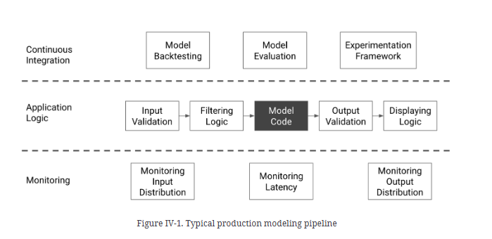
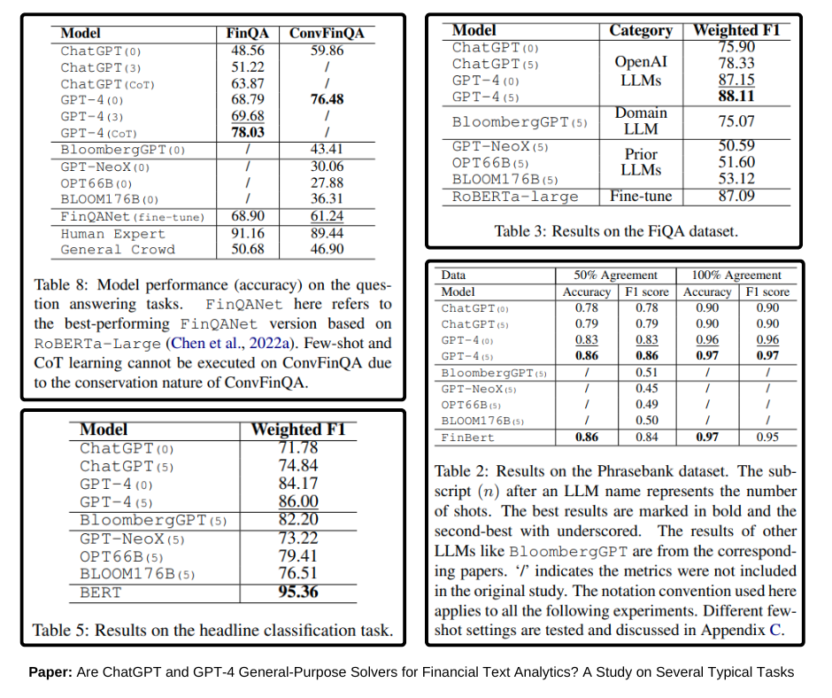

The talk "Why Fine-Tuning is Dead w/ Emmanuel Ameisen" shed light on a very interesting question: When should you fine-tune a model, and when should you use RAG (Retrieval-Augmented Generation)? The discussion was so captivating that it inspired me to compile the insights from the talk, along with my mental model in this blog to explore the "Fine-Tuning vs. RAG" debate and provide an analogy to better explain it. After all, knowledge is only useful if you can share it effectively. Additionally, writing helps to clarify my understanding of the subject, so why not?! Let's dive in.

## Why the Confusion?

Both fine-tuning and RAG (Retrieval-Augmented Generation) are meant to add knowledge to your LLM (Language Model). However, they add different types of knowledge. Fine-tuning adds knowledge that is common across all user queries, while RAG adds information that changes with each query. In terms of LLMs, fine-tuning is intended for domain adaptation, such as learning a new language, coding, domain-specific knowledge, etc. RAG is used to provide better context for answering specific user queries.

Think of an LLM as a programmer: pre-training is like learning to program, fine-tuning is like learning a second programming language or picking up data science or frontend skills after years of working as a backend software engineer. RAG is like using StackOverflow and/or docs for writing code to solve a specific problem. To solve the problem (the user query in the case of LLMs), you need both programming knowledge and context.

Another helpful analogy is that pre-training is like learning to read and write, fine-tuning is like learning a particular subject, say physics, while RAG is like taking an open-book exam. To score well on the exam, you need both a solid understanding of the subject (domain knowledge via fine-tuning) and access to context-specific information (formulas via RAG). If you know the subject well, you'll need less additional context to solve the problem. However, if you encounter a completely new problem, you will rely entirely on RAG for the necessary knowledge.

Numerous papers (such as [this one](https://arxiv.org/abs/2312.05934) and [this one](https://arxiv.org/abs/2403.01432)) have shown that adding RAG, even without any fine-tuning, can result in significant performance boosts. You may be very skilled in mathematics or physics, but you can't solve a problem if you don't have all the details. You can make some assumptions based on your domain knowledge, but there is no guarantee that you will be able to solve the problem at hand.

## When?

Still, the question remains: when to fine-tune and when to use RAG? For RAG, it's pretty simple: almost always. If you will be receiving queries about your data, then use RAG.

In the case of fine-tuning, only when one or more of these is an issue: data privacy, latency and cost, prompting is impractical. Here, I’m assuming you are using some Model-as-a-service (MaaS). If you are already using a self-hosted model, then privacy, latency, and cost will all remain the same. In such cases, fine-tuning will only be able to help with the “prompting is impractical” problem as domain adaptation can refine the model's knowledge or worldview of the problem and reduce the dependency on the user to provide all the context and craft fragile prompts to get the answer to the query.

> ⚠️ Only fine-tune if you have addressed all other aspects of your LLM service, refer to the figure below. If you are just starting to build a product or service, you will be better off using the best MaaS available. The return on investment of your time will be maximized. Prematurely trying to optimize for latency and cost can be detrimental to the product.

Source: Building Machine Learning Powered Applications by **Emmanuel Ameisen**

### In a Few Months

With ongoing advancements and economies of scale, general models are improving in reducing both latency and cost. They are being trained on much more data, resulting in better and broader world knowledge. They now have larger context windows and are becoming better at following instructions, akin to domain adaptation.

So, in a few months or a year, the answer might be to only fine-tune if you are concerned about data privacy. Even then, I would recommend against it. Instead, try self-hosting a 70B+ LLM; most often, that should suffice. Once you fine-tune, the model becomes your responsibility. With new advancements and models being released almost every week, using a model that is a couple of months old could mean being almost a decade behind in terms of LLM advancements. For example, BloombergGPT took millions of dollars to train, and within a few months, GPT-4 was released, which easily outperformed BloombergGPT on several financial tasks. Look at the screenshots below:

Bottom line, with each new advancement, you have fewer and fewer reasons to fine-tune. In the past year, the cost of using MaaS has reduced significantly while the cost to self-host an LLM has roughly remained the same.

Here is another interesting answer to the same question: [Should you fine-tune an LLM or just do prompt engineering?](https://www.quora.com/Should-you-fine-tune-an-LLM-or-just-do-prompt-engineering/answer/Tong-Hui-Kang-1)

## The Future!

Continuing with our analogy of programming, as you become a more experienced programmer, two things happen:

1. You need less context know to solve a problem because you have already seen something similar in the past.
2. You can easily pick up a new framework, tool, or even a complete programming language with just a few examples or YT videos. 

In the case of LLMs, an experienced programmer is like a very large LLM general model, such as **GPT-4** or **Claude 3 Opus,** trained on trillions of tokens. These models are exceptionally good at following instructions and can quickly adapt by simply changing the prompt or adding one-shot or few-shot examples. Additionally, adding RAG can significantly enhance performance. Even for complex tasks, like speaking a new language, adding a few pages of relevant text to the context can be sufficient.

## Summary

- General models are becoming better at domain adaptation.
- With larger context windows, prefix caching, and low latency, most use cases or motivations for LLM fine-tuning are addressed.
- Given the costs, data curation challenges, and maintenance issues associated with fine-tuning, you should generally avoid fine-tuning your own LLM. Additionally, the benefits of RAG, such as grounding and a dynamic knowledge base, make it a preferred choice in most situations.
- Unless privacy is a concern, only consider fine-tuning after you have optimized all other components of your LLM-based service and pushed it to its limits with prompting and agents.

So, to answer the question, is fine-tuning dead? Absolutely not! It has its place, use cases, and reasons to exist, much like COBOL developers and assembly programming continue to play crucial roles even today.