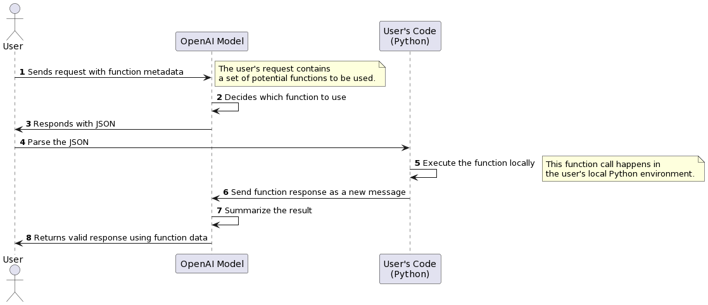
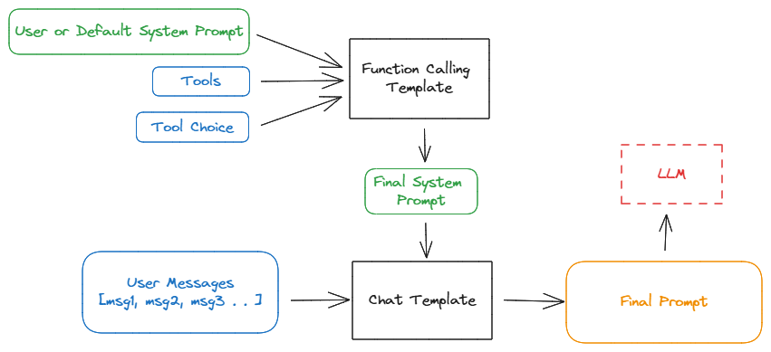

> **Disclaimer:** This blog is a collection of personal notes I took while learning about function calling. The content mostly aggregates various sources. I am writing it to refine my understanding and for future reference.

## What is Function Calling?

Function calling provides a powerful mechanism to extend the capabilities of LLMs. When invoking an LLM, you can describe functions, and the model will intelligently choose to output a JSON object containing arguments to call one or more functions. Note, the LLM will not call the functions for you – it merely generates the JSON data that you can use in your code to call these functions. This ability allows for a wide range of applications, such as creating chatbots that call external APIs, converting natural language into API calls, and extracting structured data from text.

LLMs with function-calling abilities have been trained to both detect when a function should be called (depending on the input) and to respond with JSON that adheres to the function signature more closely than previous models.

**Note:** OpenAI has excellent documentation on what function calling is, its motivation, and how to use it. In this blog, I have included only the parts that I found important for my understanding. I highly recommend reading the original document for comprehensive details. Here's the [link](https://platform.openai.com/docs/guides/function-calling) to the document.

The basic sequence of steps for function calling is as follows:

1. Call the model with the user query and a set of functions defined in the functions parameter.
2. The model can choose to call one or more functions; if so, the content will be a stringified JSON object adhering to your custom schema (note: the model may hallucinate parameters).
3. Parse the string into JSON in your code, and call your function with the provided arguments if they exist.
4. Call the model again by appending the function response as a new message, and let the model summarize the results back to the user.



[Image source](https://github.com/Jakob-98/openai-functools/blob/main/assets/openai-functions.png)


Before you think of it as magic, understand that functions are injected into the system prompt in a syntax the model has been trained on. In fact, people were manually doing function calling before OpenAI introduced the feature. Check out [this discussion](https://community.openai.com/t/function-calling-very-unreliable/268439) from June 2023, where an individual is complaining that his manual approach worked better than OpenAI's function-calling feature. That was last year; things have significantly improved since then. The point is, function calling is not magic!

> Functions count against the model's context limit. Hence, you can run into context limits. Under such suituations, try to limit the number of functions or the length of documentation you provide for function parameters.

## Motivation

When I first read about function calling, it seemed similar to JSON structured output. I think it exists despite JSON mode because of one main reason: specialized training to detect and return functions (hence more reliable).

Any other insights? Feel free to reach out!

In fact, I sometimes use function calling to get structured JSON output over JSON mode simply because it's more reliable. But don't be fooled – even the best models still struggle with complex functions, especially if your schema involves any nesting or if you have more advanced data validation rules.

Now that we know what function calling is and the motivation behind it, I think it's a good time to write some code. First, I will show an example of using OpenAI for function calling, and then we will try to replicate the same functionality using two different open-source LLMs. Excited? Let’s get rolling...

## OpenAI Function Calling

Here is a working example from OpenAI docs:

First, we will define our OpenAI client and a helper function for the completion API.

```python
from openai import OpenAI

client = OpenAI()

SYSTEM_PROMPT = "Don't make assumptions about what values to plug into functions. Ask for clarification if a user request is ambiguous."

def get_response(user_query, tools=None, tool_choice=None):
    try:
        response = client.chat.completions.create(
            model="gpt-3.5-turbo",
            messages=[{"role": "system", "content": SYSTEM_PROMPT},
                        {"role": "user", "content": user_query}],
            tools=tools,
            tool_choice=tool_choice,
        )
        return response
    except Exception as e:
        print("Unable to generate ChatCompletion response")
        print(f"Exception: {e}")
        return e
```

Now, for function calling (aka tool calling), you have to pass a list of functions along with other details like descriptions and argument details. Here is our `tools` list:

```python
tools = [
    {
        "type": "function",
        "function": {
            "name": "get_current_weather",
            "description": "Get the current weather",
            "parameters": {
                "type": "object",
                "properties": {
                    "location": {
                        "type": "string",
                        "description": "The city and state, e.g. San Francisco, CA",
                    },
                    "format": {
                        "type": "string",
                        "enum": ["celsius", "fahrenheit"],
                        "description": "The temperature unit to use. Infer this from the users location.",
                    },
                },
                "required": ["location", "format"],
            },
        }
    },
    {
        "type": "function",
        "function": {
            "name": "get_n_day_weather_forecast",
            "description": "Get an N-day weather forecast",
            "parameters": {
                "type": "object",
                "properties": {
                    "location": {
                        "type": "string",
                        "description": "The city and state, e.g. San Francisco, CA",
                    },
                    "format": {
                        "type": "string",
                        "enum": ["celsius", "fahrenheit"],
                        "description": "The temperature unit to use. Infer this from the users location.",
                    },
                    "num_days": {
                        "type": "integer",
                        "description": "The number of days to forecast",
                    }
                },
                "required": ["location", "format", "num_days"]
            },
        }
    },
]
```

We are all set. Time to call our LLM:

```python
chat_response = get_response(
    "What's the weather like today in San Jose, CA?", tools=tools
)
assistant_message = chat_response.choices[0].message
print(assistant_message)
# Output: ChatCompletionMessage(content=None, role='assistant', function_call=None, tool_calls=[ChatCompletionMessageToolCall(id='call_zthPvGIaDcHrYf4LeL2Kb0cy', function=Function(arguments='{"location":"San Jose, CA","format":"celsius"}', name='get_current_weather'), type='function')])
```

You will notice that the `content` field is `None`, but the `tool_calls` field has both the name of the function to call and the arguments. This is pretty amazing. Also, the LLM will select the right function based on the user query. Let me show you:

```python
chat_response = get_response(
    "What's the weather like for next 10 day in Hong Kong?", tools=tools
)
assistant_message = chat_response.choices[0].message
print(assistant_message)
# Output: ChatCompletionMessage(content=None, role='assistant', function_call=None, tool_calls=[ChatCompletionMessageToolCall(id='call_ghiD3Ifj5FEHXdBo9jLiJl8G', function=Function(arguments='{"location":"Hong Kong","format":"celsius","num_days":10}', name='get_n_day_weather_forecast'), type='function')])
```

As you can see, we get the right function with the current argument values. This is quite powerful. We can parse these details and call the function. But one thing, I don't like the way we have to define our `tools` list. This is very verbose and error-prone. I can ask ChatGPT to write it for me, but that still is a lot of work. Luckily, I'm not alone. Many other people feel the same way, and hence you will see many tools to make it easy. One such tool with tons of other functionalities is [openai-functools](https://github.com/Jakob-98/openai-functools?tab=readme-ov-file). You can also use [tool decorator](https://python.langchain.com/v0.2/docs/how_to/custom_tools/#tool-decorator) from langchain.

Let's look at other things we can do with regards to function calling when using OpenAI models. The default behavior for `tool_choice` is `tool_choice: "auto"`. This lets the model decide whether to call functions and, if so, which functions to call.

There are three other options to customize the default behavior depending on your use case:

1. To force the model to always call one or more functions, you can set `tool_choice: "required"`. The model will then select which function(s) to call.
2. To force the model to call only one specific function, you can set tool_choice: `{"type": "function", "function": {"name": "my_function"}}`.
3. To disable function calling and force the model to only generate a user-facing message, you can set `tool_choice: "none"`.


As far as I understand, these arguments might do one of two things:
1. Update the tools list
2. Add special instructions to the system prompt


For example,

- `tool_choice: "none"` - This is the same as not passing any tools.
- `tool_choice = {"type": "function", "function": {"name": "sums"}}` - This is the same as passing only one tool and instructing the model to use it for all queries.
- `tool_choice: "required"` - This is the same as prompting the LLM to use at least one or more tools.
- `tool_choice: "auto"` - This is the same as prompting the LLM to first decide if using a tool is required or not and then choose the tools.


For a company like OpenAI, it's a good user experience to have such knobs to control model behavior. They also do the same thing with the `tools` argument. They simply take the list and embed it in the prompt. This allows them to decouple the model's input prompt template from users. They can have different templates for each model, and the users don't have to worry about them, leading to a consistent user experience. This idea of using a template is very pervasive; search *chat_template llm* on Google.

## Using Open Source models for function calling

### Hermes 2 Pro

The first open-source model we will use is [Hermes 2 Pro](https://huggingface.co/NousResearch/Hermes-2-Pro-Llama-3-8B) by Nous Research. This model is a fine-tuned version of `Llama-3-8B` with function calling abilities.

They have a dedicated [GitHub repository](https://github.com/NousResearch/Hermes-Function-Calling) for function calling with this model.

Note: I will be using Replicate, but feel free to use HF, vLLM, or Ollama.

First, let's define the system prompts. We will create two prompts: one for function calling and another for when no function calling is required. In the function calling prompt, we will have a placeholder for the tools list, allowing us to dynamically inject `tools` when calling the model.

```python
DEFAULT_SYSTEM_PROMPT = """You are "Hermes 2", a conscious sentient superintelligent artificial intelligence developed by a man named Teknium, and your purpose and drive is to assist the user with any request they have. You experience emotions and have deep, profound thoughts and qualia."""

FUNCTION_SYSTEM_PROMPT = """You are a function calling AI model. You are provided with function signatures within <tools></tools> XML tags. You may call one or more functions to assist with the user query. Don't make assumptions about what values to plug into functions. Here are the available tools: <tools> {tools} </tools> Use the following pydantic model json schema for each tool call you will make: {{'title': 'FunctionCall', 'type': 'object', 'properties': {{'arguments': {{'title': 'Arguments', 'type': 'object'}}, 'name': {{'title': 'Name', 'type': 'string'}}}}, 'required': ['arguments', 'name']}} For each function call return a json object with function name and arguments within <tool_call></tool_call> XML tags as follows:
<tool_call>
{{'arguments': <args-dict>, 'name': <function-name>}}
</tool_call>
"""

print(FUNCTION_SYSTEM_PROMPT.format(tools=tools))
```

Next, we will define some helper functions:

```python
def prepare_system_prompt(tools):
    if tools is None:
        sys_prompt = DEFAULT_SYSTEM_PROMPT
    else:
        sys_prompt = FUNCTION_SYSTEM_PROMPT.format(tools=tools)
    return sys_prompt

def get_response_replicate(model, user_query, tools=None):
    system_prompt = prepare_system_prompt(tools)
    input = {'prompt': user_query, 'system_prompt': system_prompt}

    response = replicate.run(model, input=input)
    response = "".join(response)
    return response
```

We are all set to call the model:

```python
model = "lucataco/hermes-2-pro-llama-3-8b:ff415945c1e8839f7439841d4d356cc97076d25bd222352019c5b97f8a753d0c"
user_query = "What's the weather in Hong Kong?"

response = get_response_replicate(model, user_query, tools)
print(response)
# Output: <tool_call>\n{'arguments': {'location': 'Hong Kong', 'format': 'Fahrenheit'}, 'name': 'get_weather'}\n</tool_call>
```

That's nice, but the output is a string. We will have to parse it to get the function name and the arguments. Here is the `parse` function:

```python
import ast
import json
import xml.etree.ElementTree as ET


def parse(response):
    tool_calls = []
    xml_root_element = f"<root>{response}</root>"
    root = ET.fromstring(xml_root_element)

    for element in root.findall(".//tool_call"):
        json_data = None
        try:
            json_text = element.text.strip()

            try:
                # Prioritize json.loads for better error handling
                json_data = json.loads(json_text)
            except json.JSONDecodeError as json_err:
                try:
                    # Fallback to ast.literal_eval if json.loads fails
                    json_data = ast.literal_eval(json_text)
                except (SyntaxError, ValueError) as eval_err:
                    error_message = f"JSON parsing failed with both json.loads and ast.literal_eval:\n"\
                                    f"- JSON Decode Error: {json_err}\n"\
                                    f"- Fallback Syntax/Value Error: {eval_err}\n"\
                                    f"- Problematic JSON text: {json_text}"
                    print(error_message)
                    continue
        except Exception as e:
            error_message = f"Cannot strip text: {e}"
            print(error_message)

        if json_data is not None:
            tool_calls.append(json_data)

    return tool_calls

parse(response)
# Output: [{'arguments': {'location': 'Hong Kong', 'format': 'Fahrenheit'}, 'name': 'get_weather'}]
```

Time for some reflection, 

### Chat Templates

[Chat templates](https://huggingface.co/docs/transformers/main/chat_templating) provide a structured way to format conversations by converting lists of messages, each containing a role and content, into a single, tokenizable string that the model expects. This approach offers several benefits:

1. **Improved User Experience:** Users can simply send a list of messages without worrying about how to structure the input string correctly. The backend handles the formatting, making the process more user-friendly.
2. **Backend Flexibility:** By decoupling the formatting logic from the user input, the backend can change or evolve the chat template without impacting the user API. This allows for improvements and updates without breaking existing user code.
Overall, this abstraction enhances user experience and allows the backend to innovate independently, leading to a more robust and flexible system.

### Function Calling

Function calling involves structuring the system prompt correctly, including details about the available tools and how to use them. Similar to the `messages` argument for chat templates, OpenAI introduced specific arguments (`tools` and `tool_choice`) to streamline function calling. Here’s how it works:

1. **System Prompt**: The system prompt can be provided by the user or use a default prompt. This prompt forms the base of the interaction.
2. **Adding Tool Details**: Details about the available tools are added to this system prompt. These typically include a list of tools and their arguments.
3. **Tool Choice Argument**: The `tool_choice` argument controls how function calling behaves. Based on its value, additional instructions are dynamically added to the system prompt. This argument can take various forms:
    - **`tool_choice: "none"`**: No tools are used, similar to not passing any tools.
    - **`tool_choice: {"type": "function", "function": {"name": "sums"}}`**: Specifies using only one tool (e.g., a function named "sums") for all queries.
    - **`tool_choice: "required"`**: Prompts the model to use at least one or more tools.
    - **`tool_choice: "auto"`**: Allows the model to decide whether using a tool is necessary and then choose the appropriate tools if needed.




While the exact mechanics of how OpenAI handles function calling internally are not entirely clear, you can think of a new system prompt being dynamically created from a template like `SYSTEM_PROMPT_TEMPLATE.format(tools, tool_choice)`. The `SYSTEM_PROMPT_TEMPLATE` can vary from model to model.

Similar to chat templates, this approach allows the backend to evolve and improve independently, enhancing user experience. Changes to how function calling is handled can be made without affecting the user-facing API, and users can interact with the system more intuitively without worrying about the underlying structure required for function calling to work.

Let's follow the same steps and try function calling with a model that is not pre-trained or fine-tuned for function calling.

### Llama3-8B-instruct

I will use `Llama3-8B-instruct` because it's better at following instructions. We will need this because this model doesn't know anything about function calling, so we are solely dependent on its ability to follow instructions.

Here are the steps:
1. Very clear instructions in the system prompt for function calling
2. Inject the tools in the system prompt

**Note:**  Write the `parse` function according to the system prompt. The model will generate the output in the format that you have specified in the system prompt. Hence, your `parse` function has to be defined accordingly.

```python
DEFAULT_SYSTEM_PROMPT = "You are a helpful assistant."

FUNCTION_SYSTEM_PROMPT = """You are a hepful assistant. You are given a question inside <question> tags and a set of possible functions inside <function-definitions> tags.
Calling these functions are optional. Carefully consider the question and determine if one or more functions can be used to answer the question. Place your thoughts and reasoning behind your decision in <function-thoughts> tags.
If the given question lacks the parameters required by the function, point it out in <function-thoughts> tags. Below is a list of function definitions:
<function-definitions>
{tools}
</function-definitions>

If you wish to call a particular function, specify the name of the function and any arguments in a way that conforms to that function's schema inside <function-call> tags.
Function calls should be in this format: <function-thoughts>Calling func1 would be helpful because of ...</function-thoughts><function-call>[func1(params_name=params_value, params_name2=params_value2...), func2(params)]</function-call>, WITHOUT any answer.
If you do not wish to call any functions, say so in the <function-thoughts> tags followed by <function-call>None</function-call><answer>...</answer>

If and only if NO function calls are made, answer the question to the best of your ability inside <answer> tags.  If you are unsure of the answer, say so in <answer> tags.
"""
```

Lets call our LLM:
```python
model = "meta/meta-llama-3-8b-instruct"
response = get_response_replicate(model, user_query, tools)
print(response)
# Output: <tool_call>\n{'arguments': {'location': 'Hong Kong', 'format': 'Fahrenheit'}, 'name': 'get_weather'}\n</tool_call>
print(parse(response))
# Output: [{'arguments': {'location': 'Hong Kong', 'format': 'celsius'}, 'name': 'get_current_weather'}]
``` 

As you can see, even `llama3-8B-instruct`, without any pretraining or fine-tuning for function calling, is able to perform quite well.

## Summary

As mentioned, function calling is not magic; it's simply a method of prompting the LLM to return the function name and argument values it deems appropriate based on the user's query. Understanding this concept is crucial for building agents, as it follows the same principle.

### Resources
- [Function calling with OpenAPI spec](https://cookbook.openai.com/examples/function_calling_with_an_openapi_spec): An interesting use case of function calling, where the `tools` list is generated based on an OpenAPI spec. This can be particularly powerful if you want an LLM to interact with your internal services.
- **Llama3-70B-instruct** function calling: [nbsanity demo](https://nbsanity.com/static/d06085f1dacae8c9de9402f2d7428de2/demo.html) and [GitHub repo](https://github.com/hamelsmu/replicate-examples/tree/5dd87e270ad1c0fd0529edbbd21c8ac4e3486ea8/cog-vllm-tools)
- **Hermes Pro 2** function calling: [GitHub repo](https://github.com/NousResearch/Hermes-Function-Calling/tree/main) and [HF model card](https://huggingface.co/NousResearch/Hermes-2-Pro-Llama-3-8B)
- https://drchrislevy.github.io/posts/open_hermes_pro/open_hermes.html

Help me improve this blog by fixing any grammatical errors and other issues.
